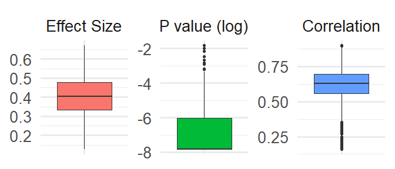
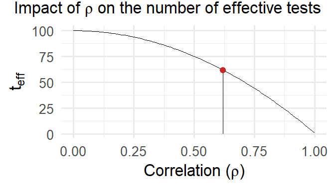
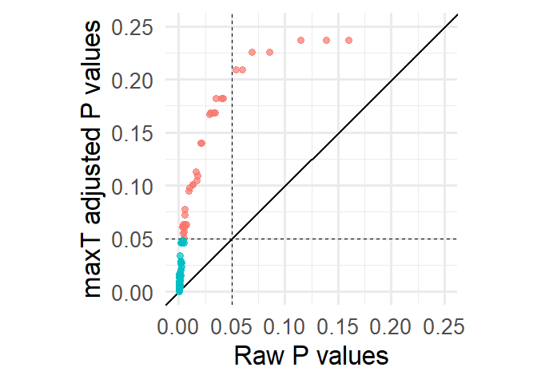

# The Multiverse problem

**As example, we used the dataset by [Daros et al. (2021)](https://pubmed.ncbi.nlm.nih.gov/34545236/)** with a multivariate meta-analysis of RCTs designs with multiple measure for the same outcome. **We considered a total of 162  plausible scenarios**.

# The Proposed Workflow

We **simulated a plausible multiverse** sampling from a multivariate normal distribution with a vector of means (i.e., the meta-analysis results) and a variance-covariance matrix for the relationship between different scenarios.

 

# Multiverse Summary

The multiverse is a associated with an **overall p-value $< 0.001$**, an **average effect  of $0.403$ ($SD = 0.112$)** and an **average correlation of $0.620$ ($SD = 0.102$)**.

# Multiverse post-hoc p-values

# Conclusions and Next Steps

- **Corrected p-values for valid post-hoc inference** on specific scenarios
- The method **control the Family-wise Error Rate (FWER)** across the multiverse
- **Fast meta-analysis via permutations** using the `flip` package
- Implementing multilevel and multivariate meta-analysis

